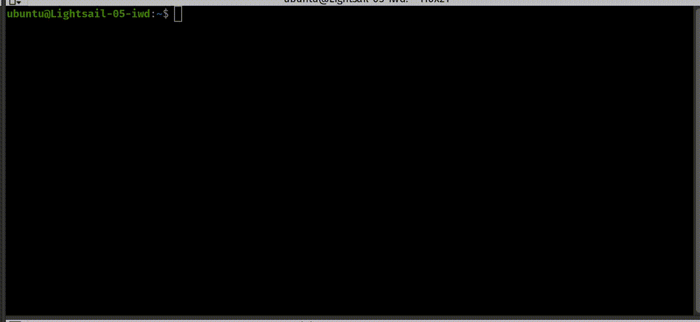

# forge-site-switcher

Quick navigation and user switching for Laravel Forge site management on Ubuntu/Debian servers.



## What It Does

- Adds a `go <username>` command to quickly switch between Forge-isolated site users
- Tab-completion for user selection
- Automatically cd's into each site's `current/` zero-downtime deployment directory
- Clean interactive shell with no TTY warnings

## Prerequisites

- AWS Lightsail Ubuntu instance (or any Ubuntu/Debian server)
- Laravel Forge with website isolation enabled
- SSH access as a sudoer user (e.g., `ubuntu`)

## Installation

### Step 1: Copy system profile script

```bash
sudo curl -o /etc/profile.d/forge-cd-current.sh https://raw.githubusercontent.com/inigopascall/forge-site-switcher/master/etc/profile.d/forge-cd-current.sh
sudo chmod 644 /etc/profile.d/forge-cd-current.sh
```

### Step 2: Add bashrc functions
```
curl https://raw.githubusercontent.com/inigopascall/forge-site-switcher/master/.bashrc-additions >> ~/.bashrc
source ~/.bashrc
```
